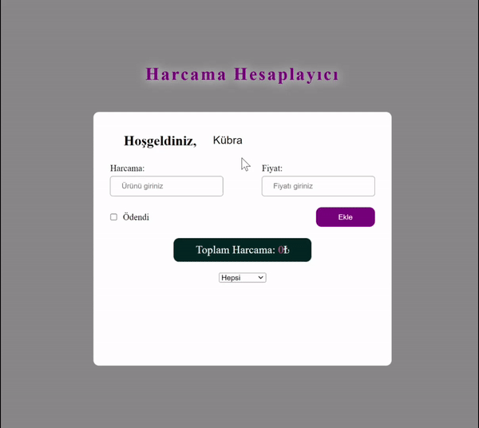

<h1> Harcama Hesaplama Projesi </h1>

Bu proje kullanıcıların harcamalarını takip etmelerini ve hesaplamaları yapmalarını sağlayan basit bir web uygulamasıdır.

<h2> Özellikler </h2>

<ul>
<li>Kullanıcıların isimlerini girebileceği bir alan bulunmaktadır.</li>
<li>Harcama adı ve fiyatı girebileceği bir form bulunmaktadır.</li>
<li>Harcama eklediğinde, eklenen harcama kartı listeye eklenir.</li>
<li>Harcamaların ödenip ödenmediği işaretlenebilir.</li>
<li>Harcamalar listesi filtrelenerek görüntülenebilir.</li>
<li>Toplam harcama miktarı her eklenen harcama ile güncellenir.</li>
</ul>

<h2> Kullanilan Teknolojiler </h2>
<ul>
<li>HTML</li>
<li>CSS</li>
<li>JavaScript</li>
</ul>

<h2>Ekran Görüntüsü</h2>

